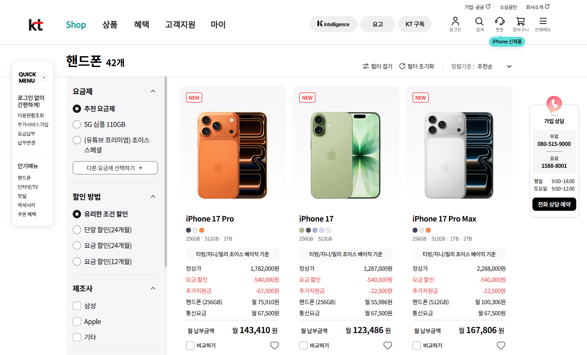
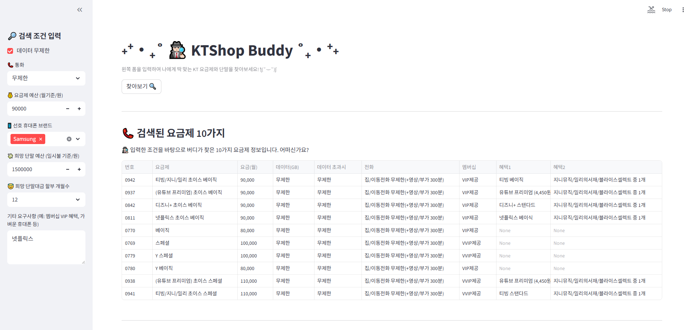
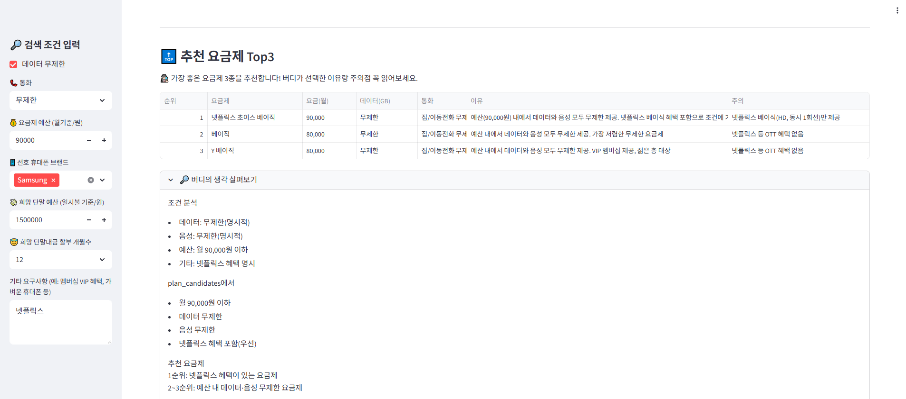

# ˖⁺‧₊˚ 🕵🏻 KTShop Buddy ˚₊‧⁺˖
  
**Azure OpenAI**, **Azure AI Search** 기반으로 구현된 **KT 요금제 및 단말 추천 웹 서비스**  
📱 [KTShop Buddy 페이지 바로가기](https://ktshop-buddy-web.azurewebsites.net/)

<br>

---

## 🤔 주제 선정 배경

KT 공식 홈페이지에서 휴대폰을 구매할 때,
사용자는 여러 페이지를 오가며 원하는 요금제의 혜택이나 조건을 일일이 비교하며 찾아야 하는 불편함이 있었습니다.


  
사용자는 “이 요금제가 나에게 맞는지” 스스로 계산해야 했습니다. 알아보기 번거로워 기존 요금제 그대로, 혹은 사이트에서 추천하는 요금제로 구매하는 경우가 많습니다. 이 프로젝트는 이러한 불편함을 해결하기 위해 시작되었습니다.

  


---
## 🚀 프로젝트 개요

> *“AI가 사용자 조건을 이해하고 가장 합리적인 요금제와 단말 조합을 제안한다.”*


**KT Shop Buddy** 는 
사용자의 데이터 사용량, 통화량, 선호 브랜드, 예산 등의 입력 조건을 바탕으로  
가장 적합한 **KT 통신 요금제와 스마트폰 조합**을 추천하는 AI 웹서비스입니다.
KT Shop Buddy를 통해 사용자는 별도의 검색이나 계산 없이 한 화면에서 요금제와 단말을 함께 추천받고, KT Shop 페이지로 이동해 구매까지 완료할 수 있습니다.


이 서비스는 Azure OpenAI의 `GPT-4.1 모델`과  
Azure AI Search의 `인덱스 Keyword 검색 기능`을 결합한 **RAG** 구조로 설계되었습니다.


## 🧩 주요 기능

#### 1️⃣ 요금제 추천
- 사용자의 **데이터 사용량(GB)**, **예산(원)**, **통화량(분)** 을 기준으로  
- 요금제 인덱스 내 <span style="color:#4374D9">Keyword 검색</span>하여 10가지 요금제 선별
  - keyword 검색 시 최대 50개 검색
  - 데이터 60%, 예산 40% 비중으로 요금제 비교 점수 계산
  - 데이터 무제한을 선택하는 경우 무제한이 아닌 요금제는 제외 후 예산으로만 점수 계산
  - 점수 낮은 순으로 10가지 요금제 최종 선별
- LLM이 검색된 요금제 중 **기타 요구사항**을 반영하여 <span style="color:#4374D9">Top3 추천</span>
- 추천 이유와 주의사항을 함께 제시하며, top3 요금제 외의 대안책도 제공함

#### 2️⃣ 단말 추천
- 사용자의 **선호 휴대폰 브랜드**, **희망 단말 예산**을 기준으로
- 단말 인덱스 내 <span style="color:#4374D9">Keyword 검색</span>하여 10가지 단말 선별
  - keyword 검색 시 최대 50개 검색
  - 예산과 단말 출고가를 비교하여 단말별 비교 점수 계산
  - 점수 낮은 순으로 10가지 단말 최종 선별
- LLM이 검색된 단말 중  **기타 요구사항**을 반영하여 <span style="color:#4374D9">Top3 추천</span>
- 추천 이유와 주의사항을 함께 제시하며, top3 단말 외의 대안책도 제공함

#### 3️⃣ 요금제 + 단말 조합 제시
- 요금제 및 단말 추천 결과를 토대로 **월 납부금액** 을 기준으로 최적의 **Top3 조합**을 계산
  - 월 납부금액: 월 요금제 + 월 단말 할부대금
  - 월 단말 할부대금의 경우 고객이 선택한 할부 개월 수 기준으로 원리금 균등상환 방식(이자율 연5.9%)으로 계산
- 각 조합은 KT Shop 바로가기 링크를 통해 즉시 구매 가능  


## 🌐 아키텍처 구조

```text
( Streamlit UI )
사용자 검색 조건 입력
   ↓
Azure AI Search
   ├─ plans-index (요금제 후보) 
   └─ devices-index (단말 후보)
   ↓
Azure OpenAI (LLM)
   ├─ 요금제 Top3 추천 및 대안 제시
   └─ 단말 Top3 추천 및 대안 제시
   ↓
요금제+단말 조합 Top3 계산 결과 노출
```

---

## 💻 주요 기술 스택

| 분야 | 사용 기술 |
|------|-------------|
| **Frontend** | Streamlit |
| **Backend** | Python |
| **LLM** | Azure OpenAI (GPT-4.1) |
| **Search Engine** | Azure AI Search |
| **Data Source** | Azure Blob Storage |


## ⚙ 주요 기능 요약

| 기능 | 설명 |
|------|------|
| 사용자 입력 | 데이터 사용량, 예산, 통화량, 선호 브랜드, 단말 예산 등 |
| 요금제 검색 | plans-index에서 후보 검색 및 LLM 기반 Top3 추천|
| 단말 검색 | devices-index에서 후보 검색 및 LLM 기반 Top3 추천|
| LLM 설명 | 각 추천 사유 및 주의사항 자동 생성 |
| 조합 제시 | 월납부액 기준으로 Top3 조합 계산 |
| KT Shop 바로가기 | 요금제/단말 정보 기반 URL 생성 |


## 🖼️ UI 구성 및 화면

```
📱 KTShop Buddy

[좌측 Sidebar]
- 데이터 사용량(GB)
- 통화량
- 요금제 예산
- 선호 휴대폰 브랜드
- 희망 단말 예산
- 희망 단말대금 할부개월 수
- 기타 요구사항 키워드

[메인 화면]
1. 📞 검색된 요금제 10가지
2. 🔝 추천 요금제 Top3 + 사유 및 대안 제시
3. 📱 검색된 단말 10가지
4. 🔝 추천 단말 Top3 + 사유 및 대안 제시
5. 🏆 버디's pick : 요금제+단말 조합 BEST 3
```





## 🔧 향후 계획

- KT 전체 요금제 및 단말 데이터 적용
- 공통지원금, 추가지원금 등 단말별/가입유형별 KT 지원금 정책 적용
- Azure Search 벡터 인덱싱 (Semantic Hybrid Search 적용)  
- LangGraph 기반 다중 노드 워크플로우 적용

---

## 👩🏻‍💻 제작자

> **kt ds 오픈채널서비스팀 조안나 선임**  
> KT샵 개발/운영
